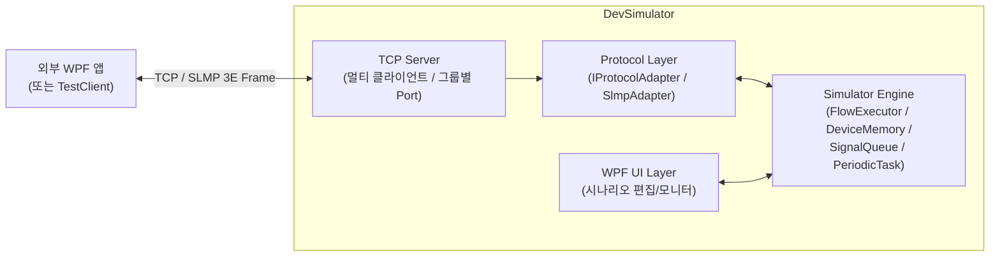
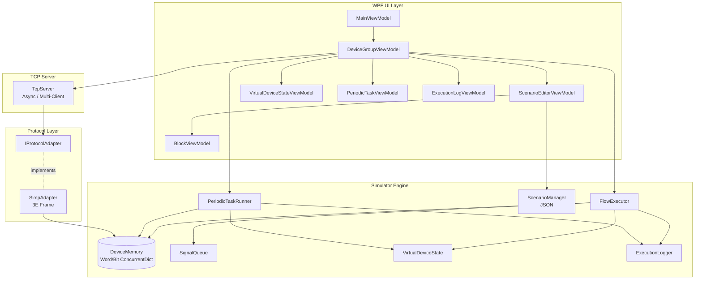
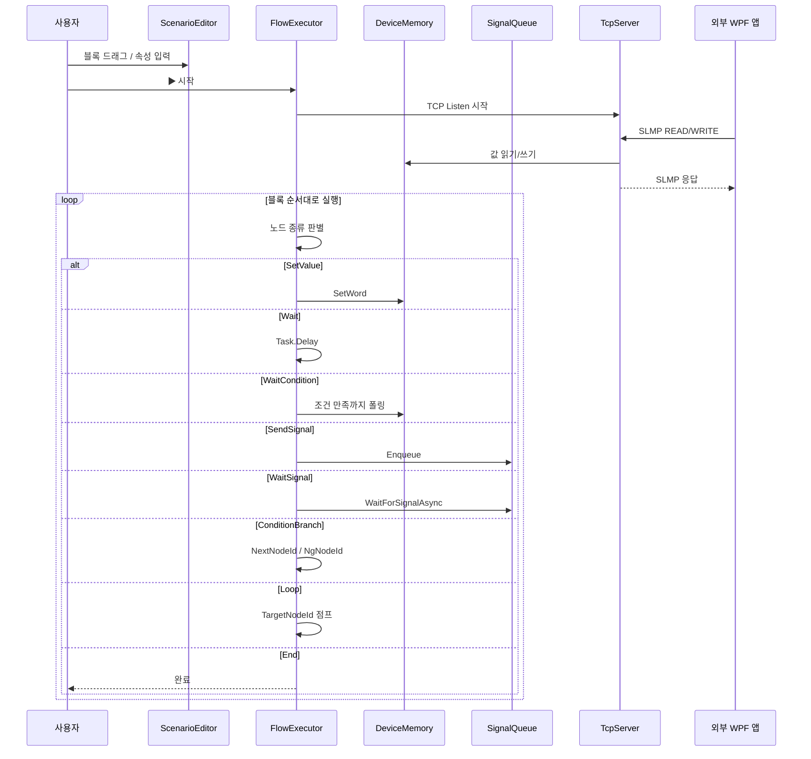
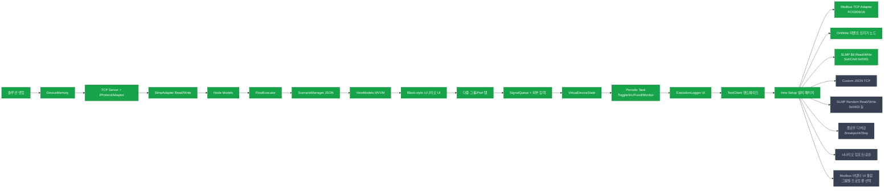

# DevSimulator

> 미쯔비시 PLC를 비롯한 산업 장비를 소프트웨어로 모사하는 **범용 통신 시뮬레이터**

실제 장비 없이 WPF 앱을 개발·테스트할 수 있고, 블록코딩(시나리오) 방식으로 장비의 응답 로직을 직접 정의합니다.

---

## 시스템 구성도



WPF 앱 입장에서는 실제 PLC와 구분이 없습니다. 실제 PLC로 교체할 때 **IP만 바꾸면** 됩니다.

---

## 주요 기능

- 🔌 **SLMP (MC Protocol) 3E Frame** — 미쯔비시 Q / iQ-R 시리즈 호환 (Read 0x0401 / Write 0x1401)
- 🧩 **블록형 시나리오 편집기** — 위→아래 단계로 노드를 드래그 배치, 핸드쉐이크 같은 순차 흐름 표현에 최적화
- 🗂️ **다중 장치 그룹 (탭)** — 여러 장치(다른 Port)를 동시에 시뮬레이트, 그룹별 시작/정지/저장
- ⏱️ **주기 태스크** — Toggle / Increment / Fixed / Monitor (수신 감시·타임아웃) 모드
- 📡 **신호(시그널) 통신** — 시나리오 블록 사이 비동기 신호 송수신, 외부 입력 모사도 지원
- 🌐 **가상 장치 상태** — PLC 디바이스가 아닌 자체 상태 변수 (핸드쉐이크 머신용)
- 📜 **실행 로그** — 모든 노드 실행 내역을 시간순으로 확인
- 💾 **시나리오 저장/불러오기** — JSON
- 🛠️ **TestClient** — 동봉된 WPF SLMP 클라이언트 (연결 / 읽기 / 쓰기 / 핸드쉐이크 테스트)

---

## 아키텍처



---

## 시나리오 실행 흐름



---

## 지원 노드

| 카테고리 | 노드 | 설명 | 상태 |
|---|---|---|---|
| 신호 | SendSignal | 시그널 송신 (외부/내부) | ✅ |
| 신호 | WaitSignal | 시그널 수신 대기 (타임아웃) | ✅ |
| 시간 | Wait | 지정 ms 만큼 대기 | ✅ |
| SLMP | SetValue | 디바이스(D/M/Y/X) 값 쓰기 | ✅ |
| SLMP | WaitCondition | 디바이스 값이 조건을 만족할 때까지 폴링 | ✅ |
| 상태 | DeviceStateChange | 가상 변수 값 변경 | ✅ |
| 분기 | ConditionBranch | 변수 비교 → OK/NG 분기 | ✅ |
| 흐름 | Loop | 지정 단계로 점프 (반복 횟수 제한) | ✅ |
| 종료 | End | 시나리오 종료 | ✅ |

주기 태스크 모드: **Toggle / Increment / Fixed / Monitor (수신 감시 + 타임아웃)**

---

## 빠른 시작

### 요구사항
- Windows 10/11
- Visual Studio 2022 + .NET 8 데스크톱 개발 워크로드

### 실행
```bash
git clone https://github.com/ygyun3937/DevSimulator.git
```
`SimulatorProject.sln` 을 Visual Studio로 열고 **Ctrl+F5** 실행.

### 테스트
앱 실행 후 ▶ 시작 클릭. 그 다음 다음 중 하나로 검증:

```bash
# Python 스크립트
cd examples
python test_slmp.py
```

또는 동봉된 WPF **TestClient** 프로젝트를 같이 실행해서 GUI로 연결/읽기/쓰기/핸드쉐이크 시뮬레이션.

---

## 프로젝트 구조

```
SimulatorProject/
├── Engine/
│   ├── DeviceMemory.cs            # 스레드 안전 레지스터 저장소 (Word/Bit 동기화)
│   ├── FlowExecutor.cs            # 시나리오 실행 엔진 (모든 노드 핸들링)
│   ├── ScenarioManager.cs         # JSON 저장/불러오기
│   ├── SignalQueue.cs             # 블록 간 비동기 신호 큐
│   ├── VirtualDeviceState.cs      # 가상 변수 상태
│   ├── PeriodicTask.cs            # 주기 태스크 (Toggle/Inc/Fixed/Monitor)
│   ├── ExecutionLogger.cs         # 실행 로그
│   └── DeviceInfo.cs
├── Nodes/
│   ├── NodeBase.cs (+ Order/NextNodeId)
│   ├── SetValueNode / WaitNode / EndNode
│   ├── ConditionNode / ConditionBranchNode (OK/NG)
│   ├── WaitConditionNode (폴링)
│   ├── LoopNode (단계 점프 + 횟수 제한)
│   ├── SendSignalNode / WaitSignalNode
│   └── DeviceStateChangeNode
├── Protocol/
│   ├── IProtocolAdapter.cs
│   ├── SlmpAdapter.cs             # SLMP 3E Frame Read/Write
│   └── TcpServer.cs               # async 멀티 클라이언트
├── ViewModels/
│   ├── MainViewModel.cs           # 다중 그룹 관리
│   ├── DeviceGroupViewModel.cs    # 그룹 단위 시뮬레이터 (Port/시작/정지)
│   ├── ScenarioEditorViewModel.cs # 블록 리스트 (위→아래)
│   ├── BlockViewModel.cs          # 단계 카드
│   ├── PeriodicTaskViewModel.cs
│   ├── VirtualDeviceStateViewModel.cs
│   ├── ExecutionLogViewModel.cs
│   ├── DeviceMonitorViewModel.cs
│   ├── FlowChartViewModel.cs / NodeViewModel.cs / ConnectionViewModel.cs
│   └── ...
├── Views/
│   └── NodeControl.xaml(.cs)
├── MainWindow.xaml(.cs)
└── App.xaml(.cs)

SimulatorProject.Tests/             # xUnit + FluentAssertions
TestClient/                         # 동봉 WPF SLMP 클라이언트 (핸드쉐이크 테스트 포함)
docs/                               # 사용자 가이드 / 설계 문서 / 구현 계획
examples/                           # 샘플 시나리오 JSON / SLMP 테스트 스크립트
DevSimulaotr_Iss.iss                # Inno Setup 설치 파일 스크립트
```

---

## 진행 현황



### 완료 ✅
1. 솔루션·WPF·xUnit 프로젝트 셋업
2. **DeviceMemory** — `ConcurrentDictionary` 기반, Word/Bit 자동 동기화, `ValueChanged` 이벤트
3. **TcpServer** — 비동기 멀티 클라이언트 + 클라이언트 카운트/로그 이벤트
4. **SlmpAdapter** — SLMP 3E Frame Read(`0x0401`) / Write(`0x1401`)
5. **Node Model** — Set/Wait/Condition/End + WaitCondition / ConditionBranch / Loop / SendSignal / WaitSignal / DeviceStateChange (총 10종)
6. **FlowExecutor** — 모든 노드 처리 + 루프 카운터 + 취소 토큰
7. **ScenarioManager** — `JsonDerivedType` 기반 다형성 직렬화/역직렬화
8. **MVVM ViewModels** — Main / DeviceGroup / ScenarioEditor / Block / PeriodicTask / VirtualDeviceState / ExecutionLog
9. **블록형 시나리오 UI** — 위→아래 단계 리스트, 드래그/드롭, 단계 번호, 실행 중 노드 노란 테두리 하이라이트, 단계 사이 삽입 화살표
10. **다중 장치 그룹 탭** — 그룹별로 별도 Port·시나리오·메모리, 전체 시작/정지/초기화
11. **주기 태스크 패널** — Toggle / Increment / Fixed / Monitor 모드 (Monitor는 수신 감시 + 타임아웃 → 가상 상태 키에 OK/TIMEOUT 기록)
12. **외부 입력 모사** — 신호를 수동으로 큐에 주입해 `WaitSignal` 블록을 트리거
13. **실행 로그** — 모든 노드 실행 내용을 콘솔 스타일로 표시 (지우기 가능)
14. **TestClient (별도 WPF 프로젝트)** — 연결 / Read / Write / **핸드쉐이크 시나리오** (M100 ON → M101==1 대기 → D200/D201 읽기 → M100 OFF → M101==0 대기)
15. **Inno Setup 설치 파일 스크립트** (`DevSimulaotr_Iss.iss`)
16. **샘플 시나리오** — `scenario1.json`, `scenario_handshake.json`, `scenario_testclient.json`
17. **단위 테스트** — DeviceMemory / SlmpAdapter / FlowExecutor / ScenarioManager (총 28개 PASS)
18. **SLMP 비트 명령** — `0x0401/0x1401` SubCmd `0x0001` (4비트 nibble 패킹) — `M/X/Y/B/L` 비트 디바이스 표준 명령 호환
19. **Modbus TCP 어댑터** — `ModbusAdapter` 클래스, FC 03(Read Holding) / 06(Write Single) / 16(Write Multiple), MBAP 헤더, 예외 응답 — 디바이스 키는 `HR{N}` 매핑
20. **OnWriteNode** — `DeviceMemory.ValueChanged` 이벤트 기반 트리거 (폴링 X), 외부 쓰기 즉시 시나리오 진행
21. **통신 프로토콜 가이드** ([docs/protocol-guide.md](docs/protocol-guide.md)) — SLMP + Modbus 와이어 포맷, Python/C# 클라이언트 예제, 핸드쉐이크 패턴, 치트시트, FAQ

### 앞으로 할 일 🔜
- **Modbus 어댑터 UI 통합** — 그룹 생성 시 프로토콜(SLMP / Modbus) 선택 (현재는 코드 교체 필요)
- **Custom JSON TCP** 어댑터
- **SLMP 추가 명령** — Random Read/Write(`0x0403`), 다중 디바이스 일괄 처리
- **`On Request` 이벤트 트리거** — 현재 `OnWrite`만 있음. 외부 앱이 읽기 요청만 보내도 시나리오 트리거되게
- **플로우 디버깅** — 중단점, 스텝 실행, 변수 watch
- **시나리오 임포트/공유** — 마켓플레이스/내보내기
- **GitHub Actions CI** — 빌드 + 테스트 자동화
- **사용자 가이드 보강** — 그룹·주기 태스크·핸드쉐이크 예제 추가

---

## 지원 프로토콜

| 프로토콜 | 상태 |
|---|---|
| SLMP / MC Protocol (미쯔비시) | ✅ Word + Bit Read/Write |
| Modbus TCP | ✅ FC 03 / 06 / 16 (어댑터 클래스 완료, UI 통합 예정) |
| Custom TCP (JSON 등) | 🔜 예정 |

---

## 문서

- [🧭 사용 가이드 (비개발자용)](docs/setup-guide.md) — 5분 만에 시뮬레이터 켜고 내 앱 연결하기, 트러블슈팅
- [📖 사용자 가이드 (상세)](docs/user-guide.md)
- [🔌 통신 프로토콜 명세 (개발자용)](docs/protocol-guide.md) — SLMP 3E Frame + Modbus TCP 와이어 포맷, 클라이언트 예제, 핸드쉐이크 패턴
- [🏗️ 설계 문서](docs/superpowers/specs/2026-04-01-devsimulator-design.md)
- [📋 구현 계획](docs/superpowers/plans/2026-04-01-devsimulator.md)
- [🤝 서브에이전트 활용 가이드](docs/subagent-guide.md)

> 💡 위 문서들은 DevSimulator 앱의 타이틀바 **❓ 도움말** 버튼으로 in-app에서도 볼 수 있습니다.
