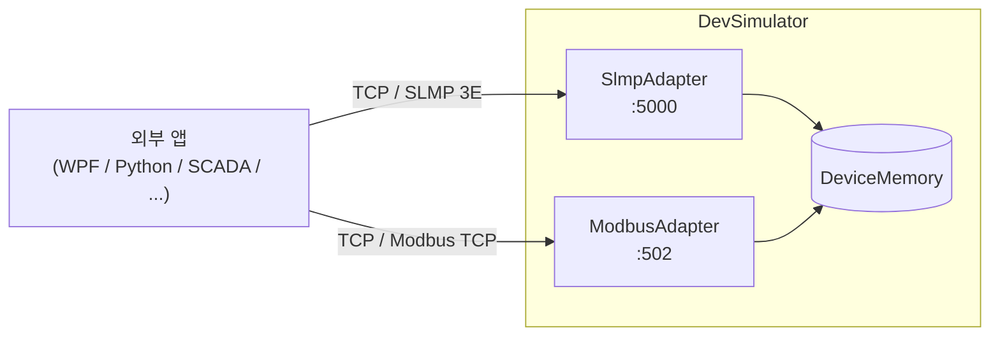
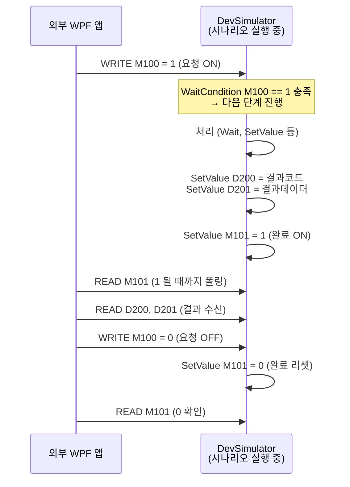
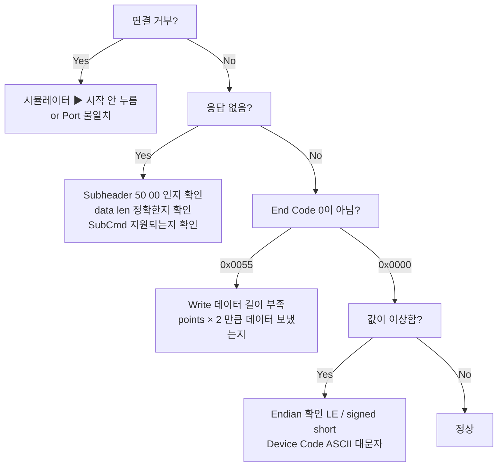

# DevSimulator 통신 프로토콜 가이드

> **대상:** DevSimulator와 데이터를 주고받을 외부 앱(WPF/Python/Node.js 등)을 만드는 개발자
> **버전:** v2 — **Part 1: SLMP (MC Protocol) 3E Frame** + **Part 2: Modbus TCP**

---

## 0. 한 줄 요약

DevSimulator는 두 가지 산업용 프로토콜을 동시에 받을 수 있다:

| 프로토콜 | 어댑터 클래스 | 기본 포트 | 호환 대상 |
|---|---|---|---|
| **SLMP (MC Protocol) 3E Frame** | `SlmpAdapter` | `5000` | 미쯔비시 Q / iQ-R PLC |
| **Modbus TCP** | `ModbusAdapter` | `502` | Modbus 표준 슬레이브 (Schneider, Wago 등) |

둘 다 **TCP 기반**이며, 클라이언트는 자기 앱이 쓸 프로토콜에 맞는 어댑터에 연결하면 된다. **실제 장비와 와이어 호환**이라 IP/Port만 바꾸면 시뮬레이터 ↔ 실 장비 교체 가능.



> **주의:** 현재 UI(`DeviceGroupViewModel`)는 SLMP 어댑터를 하드코딩해 사용한다. Modbus 어댑터는 클래스로 구현되어 있으니, 별도 그룹에서 사용하려면 `DeviceGroupViewModel.StartAsync` 안에서 `new SlmpAdapter()`를 `new ModbusAdapter()`로 교체하면 즉시 동작한다.

---

# Part 1 — SLMP (MC Protocol) 3E Frame

---

## 1. 연결 방법

| 항목 | 값 |
|---|---|
| 트랜스포트 | TCP (스트림) |
| 기본 포트 | `5000` (DevSimulator 그룹 탭에서 변경) |
| 호스트 | 같은 PC: `127.0.0.1` / LAN: `192.168.x.x` |
| 동시 연결 | 멀티 클라이언트 가능 (그룹 단위 `TcpServer`) |
| 인증/암호화 | **없음** (실 PLC SLMP와 동일) |

**연결 예시 (Python):**
```python
import socket
s = socket.socket(socket.AF_INET, socket.SOCK_STREAM)
s.connect(("127.0.0.1", 5000))
```

**연결 예시 (C#):**
```csharp
var tcp = new TcpClient();
await tcp.ConnectAsync("127.0.0.1", 5000);
var stream = tcp.GetStream();
```

> ⚠️ 시뮬레이터의 ▶ **시작** 버튼을 누르지 않은 상태에서는 TCP 리스너가 열리지 않는다. 연결 거부(`ConnectionRefusedError`)가 나면 앱 상태를 먼저 확인할 것.

---

## 2. SLMP 3E Frame 개요

모든 메시지는 **요청(클라이언트→시뮬레이터)** 또는 **응답(시뮬레이터→클라이언트)** 둘 중 하나. 모든 멀티바이트 정수는 **리틀 엔디언(LE)**.

### 요청 프레임 공통 구조

```
오프셋  크기  필드            값/설명
─────  ───  ─────────────   ─────────────────────────────
  0     2   Subheader        50 00          (요청 식별자)
  2     1   Network No       00             (보통 0x00)
  3     1   PC No            FF             (자국)
  4     2   I/O No           FF 03          (CPU 자체)
  5         (포함)
  6     1   Station No       00
  7     2   Request Data Len LE, CPU 타이머부터 끝까지 바이트 수
  9     2   CPU Timer        10 00          (= 250ms × 16, 의미는 무시됨)
 11     2   Command          LE             (0401=Read, 1401=Write)
 13     2   SubCommand       LE             (0000=Word, 0001=Bit)
 15     3   Device No        LE 3바이트     (예: 100 = 64 00 00)
 18     1   Device Code      ASCII          ('D' 0x44, 'M' 0x4D, 'Y' 0x59, 'X' 0x58)
 19     2   Number of Points LE             (Word: 2바이트씩 / Bit: 1비트씩)
 21    ... Data (Write일 때만)
```

> 헤더 9바이트(오프셋 0~8) + 데이터 길이는 **오프셋 9 이후의 바이트 수**를 의미한다. 워드 Read는 데이터가 없으니 길이가 12, 워드 Write는 12 + (포인트 수 × 2).

### 응답 프레임 공통 구조

```
오프셋  크기  필드             값/설명
─────  ───  ──────────────   ─────────────────────────────
  0     2   Subheader         D0 00          (응답 식별자)
  2     1   Network No        echo
  3     1   PC No             echo
  4     2   I/O No            echo
  6     1   Station No        echo
  7     2   Response Data Len LE, EndCode부터 끝까지
  9     2   End Code          LE (0000 = 성공, 그 외 = 에러)
 11    ... Data (Read 응답일 때만)
```

---

## 3. 디바이스 코드

| 코드 (ASCII) | 디바이스 | 종류 | 설명 |
|---|---|---|---|
| `D` (0x44) | 데이터 레지스터 | Word | 일반 16비트 데이터 |
| `M` (0x4D) | 내부 릴레이 | Bit | 일반 비트 플래그 |
| `X` (0x58) | 입력 | Bit | 외부 입력 비트 |
| `Y` (0x59) | 출력 | Bit | 외부 출력 비트 |
| `B` (0x42) | 링크 릴레이 | Bit | (시뮬레이터에서는 일반 비트와 동일 동작) |
| `L` (0x4C) | 래치 릴레이 | Bit | (시뮬레이터에서는 일반 비트와 동일 동작) |

> **참고:** 시뮬레이터는 비트 디바이스(`M/X/Y/B/L`)에 워드 명령을 보내도 동작한다 (값을 0/1 워드로 처리). 반대도 마찬가지. 단, **실제 PLC 호환성을 위해서는 비트는 비트 명령으로, 워드는 워드 명령으로 사용**할 것을 권장.

키 표기는 항상 `<코드><번호>` 형식의 대문자 ASCII: `D100`, `M0`, `Y10`. 시뮬레이터 내부에서는 그대로 dictionary 키로 쓰인다.

---

## 4. 워드 Read — Command `0x0401`, SubCmd `0x0000`

### 요청 (12바이트 데이터부)

```
[50 00] [00] [FF] [FF 03] [00] [0C 00]      ← 헤더 (datalen = 12)
[10 00]                                      ← CPU timer
[01 04]                                      ← Command 0x0401 LE
[00 00]                                      ← SubCmd 0x0000 (Word)
[64 00 00]                                   ← Device No 100
[44]                                         ← Device Code 'D'
[01 00]                                      ← 1 point
```

### 응답 (Read는 데이터 포함)

```
[D0 00] [00 FF FF 03 00] [04 00]   ← 헤더, respLen = 4 (endCode 2 + data 2)
[00 00]                            ← End Code = 성공
[D2 04]                            ← D100 값 = 0x04D2 = 1234 (signed short LE)
```

### Python 예제 — D100 읽기

```python
import socket, struct

s = socket.socket(); s.connect(("127.0.0.1", 5000))

req = bytes([
    0x50, 0x00, 0x00, 0xFF, 0xFF, 0x03, 0x00,  # 헤더
    0x0C, 0x00,                                  # data len = 12
    0x10, 0x00,                                  # CPU timer
    0x01, 0x04,                                  # Command READ
    0x00, 0x00,                                  # SubCmd Word
    0x64, 0x00, 0x00,                            # Device 100
    0x44,                                        # 'D'
    0x01, 0x00,                                  # 1 point
])
s.sendall(req)
resp = s.recv(256)
end_code = struct.unpack_from("<H", resp, 9)[0]
value    = struct.unpack_from("<h", resp, 11)[0]
print(f"D100 = {value} (endCode=0x{end_code:04X})")
```

### 연속 읽기 (D0~D4)
- `Number of Points` 만 5로 변경 (`05 00`).
- 응답 데이터 길이 = 5 × 2 = 10바이트, `오프셋 11`부터 `D2 04 14 00 1E 00 ...` 형식.

---

## 5. 워드 Write — Command `0x1401`, SubCmd `0x0000`

### 요청 (Write는 데이터 포함)

```
[50 00] [00] [FF] [FF 03] [00] [0E 00]   ← datalen = 12 + 2 = 14
[10 00] [01 14] [00 00]                  ← CPU timer / Command WRITE / SubCmd Word
[64 00 00] [44] [01 00]                  ← D100 / 1 point
[D2 04]                                  ← 데이터 1234 (LE signed short)
```

### 응답 (성공 시 데이터 없음)

```
[D0 00] [00 FF FF 03 00] [02 00] [00 00]
                          ↑ respLen=2  ↑ endCode=0 (성공)
```

### Python 예제 — D100 = 1234

```python
req = bytes([
    0x50, 0x00, 0x00, 0xFF, 0xFF, 0x03, 0x00,
    0x0E, 0x00,                # data len = 14
    0x10, 0x00, 0x01, 0x14, 0x00, 0x00,
    0x64, 0x00, 0x00, 0x44, 0x01, 0x00,
    0xD2, 0x04,                # 값 1234
])
s.sendall(req)
resp = s.recv(256)
print("성공" if resp[9] == 0 and resp[10] == 0 else f"에러 0x{resp[10]:02X}{resp[9]:02X}")
```

### 연속 쓰기 (D0~D4 = [10,20,30,40,50])
- `Number of Points = 05 00`
- 데이터부에 5 × 2 = 10바이트 추가, `data len`은 `12 + 10 = 22 → 16 00`.

---

## 6. 비트 Read — Command `0x0401`, SubCmd `0x0001`

비트 디바이스(`M / X / Y / B / L`)를 비트 단위로 읽는다. 워드 Read와 동일한 헤더에 **SubCmd만 `01 00`** 으로 바꾸면 된다.

### 응답 데이터 패킹 (핵심)
- 비트 1개 = 4비트(nibble). 1바이트에 비트 2개를 패킹.
- `byte[N]`의 **상위 nibble = 짝수 인덱스 비트**(0, 2, 4, ...), **하위 nibble = 홀수 인덱스 비트**(1, 3, 5, ...).
- 데이터 바이트 수 = `(points + 1) / 2`.
- 홀수 개일 때 마지막 바이트 하위 nibble = 0 (padding, 무시).

### 요청 — `M0`부터 5비트 읽기

```
[50 00] [00] [FF] [FF 03] [00] [0C 00]      ← 헤더 (datalen = 12)
[10 00]                                      ← CPU timer
[01 04]                                      ← Command 0x0401 LE
[01 00]                                      ← SubCmd 0x0001 (Bit) ★
[00 00 00]                                   ← Device No 0
[4D]                                         ← Device Code 'M'
[05 00]                                      ← 5 points
```

### 응답 — `M0=1, M1=0, M2=1, M3=1, M4=0` 일 때

```
[D0 00] [00 FF FF 03 00] [05 00]   ← respLen = 2 + ⌈5/2⌉ = 5
[00 00]                            ← End Code = 성공
[10 11 00]                         ← 비트 데이터
                                      byte0: M0(상)=1, M1(하)=0  → 0x10
                                      byte1: M2(상)=1, M3(하)=1  → 0x11
                                      byte2: M4(상)=0, padd =0   → 0x00
```

### Python 예제 — M0~M4 읽기

```python
req = bytes([
    0x50, 0x00, 0x00, 0xFF, 0xFF, 0x03, 0x00,
    0x0C, 0x00,
    0x10, 0x00,
    0x01, 0x04,
    0x01, 0x00,                # SubCmd = Bit
    0x00, 0x00, 0x00, 0x4D,    # M0
    0x05, 0x00,                # 5 points
])
s.sendall(req); resp = s.recv(256)

bits = []
n_bytes = (5 + 1) // 2          # 3 bytes
for i in range(5):
    b = resp[11 + i // 2]
    nibble = (b >> 4) & 0xF if (i & 1) == 0 else b & 0xF
    bits.append(1 if nibble else 0)
print(bits)   # → [1, 0, 1, 1, 0]
```

---

## 7. 비트 Write — Command `0x1401`, SubCmd `0x0001`

비트 디바이스를 비트 단위로 쓴다. 데이터 패킹은 비트 Read 응답과 **완전히 동일**.

### 요청 — `M0~M3 = [1, 0, 1, 1]` 쓰기

```
[50 00] [00] [FF] [FF 03] [00] [0E 00]      ← datalen = 12 + ⌈4/2⌉ = 14
[10 00]
[01 14]                                      ← Command 0x1401 (Write)
[01 00]                                      ← SubCmd 0x0001 (Bit) ★
[00 00 00]                                   ← Device No 0
[4D]                                         ← Device Code 'M'
[04 00]                                      ← 4 points
[10 11]                                      ← 비트 데이터
                                                byte0: M0=1(상), M1=0(하)  → 0x10
                                                byte1: M2=1(상), M3=1(하)  → 0x11
```

### 응답 (성공 시 데이터 없음)

```
[D0 00] [00 FF FF 03 00] [02 00] [00 00]
```

### Python 예제 — M0~M3 = [1,0,1,1]

```python
def pack_bits(bits):
    """비트 리스트 → SLMP nibble 패킹 바이트열"""
    n = (len(bits) + 1) // 2
    out = bytearray(n)
    for i, b in enumerate(bits):
        if not b: continue
        out[i // 2] |= (0x10 if (i & 1) == 0 else 0x01)
    return bytes(out)

bits = [1, 0, 1, 1]
data = pack_bits(bits)              # → b'\x10\x11'
points = len(bits)
data_len = 12 + len(data)           # = 14

req = bytes([
    0x50, 0x00, 0x00, 0xFF, 0xFF, 0x03, 0x00,
    data_len & 0xFF, (data_len >> 8) & 0xFF,
    0x10, 0x00,
    0x01, 0x14,                # Command Write
    0x01, 0x00,                # SubCmd Bit
    0x00, 0x00, 0x00, 0x4D,
    points & 0xFF, (points >> 8) & 0xFF,
]) + data

s.sendall(req); resp = s.recv(256)
print("성공" if resp[9] == 0 and resp[10] == 0 else "에러")
```

> **홀수 비트 쓰기:** 마지막 바이트의 하위 nibble은 padding으로 처리되어 무시된다. 예를 들어 3비트 쓰기에 `[0x11, 0x1F]`를 보내면 `0xF` padding은 버려지고 `M3`는 영향을 받지 않는다.

---

## 8. End Code (에러 코드)

| End Code | 의미 | DevSimulator 발생 조건 |
|---|---|---|
| `0x0000` | 성공 | 정상 처리 |
| `0x0055` | 데이터 길이 부족 | Write 요청에 명시한 포인트 수만큼의 데이터가 없을 때 |
| (응답 없음) | 프레임 헤더가 잘못됨 / 미지원 명령 | 시뮬레이터는 `null`을 반환하므로 클라이언트는 응답을 받지 못한다 (`recv` 타임아웃 처리 권장) |

> **주의:** 시뮬레이터는 미지원 명령에 대해 SLMP 표준 에러 코드(`0xC059` 등)를 보내지 않고 **연결을 유지한 채 응답을 보내지 않는다**. 클라이언트 측에서 read timeout을 설정해야 hang을 피할 수 있다.

---

## 9. 클라이언트 라이브러리 (즉시 사용 가능)

DevSimulator 저장소에 다음 예제가 포함되어 있다:

| 파일 | 언어 | 용도 |
|---|---|---|
| [`examples/test_slmp.py`](../examples/test_slmp.py) | Python 3 | Read/Write 통합 테스트 스크립트 |
| [`examples/SlmpClient.cs`](../examples/SlmpClient.cs) | C# (.NET) | WPF 앱에서 그대로 복사해 쓰는 클라이언트 클래스 |
| [`TestClient/SlmpClient.cs`](../TestClient/SlmpClient.cs) | C# (WPF) | 동봉된 GUI 테스트 앱이 사용하는 클라이언트 |

### C# 사용 패턴 (요약)

```csharp
using var client = new SlmpClient("127.0.0.1", 5000);
await client.ConnectAsync();

short val = await client.ReadWordAsync("D100");
await client.WriteWordAsync("D100", 1234);

short[] block = await client.ReadWordsAsync("D0", 5);
await client.WriteWordsAsync("D0", new short[] { 10, 20, 30, 40, 50 });
```

### Python 사용 패턴 (요약)

```python
from test_slmp import build_read_request, build_write_request, parse_read_response
import socket

with socket.create_connection(("127.0.0.1", 5000)) as s:
    s.sendall(build_write_request(100, 'D', [1234]))
    s.recv(256)

    s.sendall(build_read_request(100, 'D', 1))
    print(parse_read_response(s.recv(256), 1))   # → [1234]
```

---

## 10. 핸드쉐이크 패턴 (시나리오 통신 예제)

DevSimulator의 강점은 단순 Read/Write 응답이 아니라 **시나리오 기반 응답 로직**이다. 핸드쉐이크 형태(요청→처리→완료신호→리셋)로 통신하는 패턴 예시:



이 패턴의 실제 구현은 [`TestClient/MainWindow.xaml.cs`](../TestClient/MainWindow.xaml.cs)의 `BtnHandshake_Click`와 [`examples/scenario_handshake.json`](../examples/scenario_handshake.json) 시나리오에서 확인 가능.

---

# Part 2 — Modbus TCP

> Modbus는 산업 자동화에서 가장 널리 쓰이는 오픈 프로토콜 중 하나. SLMP가 미쯔비시 PLC 전용이라면, Modbus TCP는 PLC뿐 아니라 인버터, HMI, 센서, SCADA 등 다양한 장비가 사용한다. DevSimulator는 표준 Modbus TCP 스펙(IETF 권장)을 그대로 따른다.

## M1. 개요

| 항목 | 값 |
|---|---|
| 트랜스포트 | TCP |
| 기본 포트 | `502` |
| 엔디언 | **빅 엔디언(BE)** ← SLMP의 LE와 다름 ⚠️ |
| 어댑터 클래스 | `SimulatorProject.Protocol.ModbusAdapter` |
| 지원 Function Code | `03` Read Holding, `06` Write Single, `16(0x10)` Write Multiple |
| 디바이스 키 매핑 | Modbus 주소 N → DeviceMemory 키 `"HR{N}"` (예: 100 → `HR100`) |

> SLMP는 `D100` 같은 키를, Modbus는 `HR100` 같은 키를 쓴다. 같은 `DeviceMemory` 내에서 키가 안 겹치므로 두 프로토콜이 **동시에 다른 메모리 영역**을 보게 된다.

## M2. MBAP Header (모든 메시지 공통, 7바이트)

```
오프셋  크기  필드              엔디언   설명
  0     2   Transaction ID    BE      클라이언트 식별자, 응답에 echo
  2     2   Protocol ID       BE      항상 0x0000
  4     2   Length            BE      Unit ID + PDU 바이트 수
  6     1   Unit ID           -       슬레이브 주소 (보통 0xFF), 응답 echo
```

PDU(Protocol Data Unit) = `Function Code(1B) + 데이터`

## M3. FC 03 — Read Holding Registers

### 요청 PDU
```
[03] [start addr BE 2B] [quantity BE 2B]
```

### 응답 PDU
```
[03] [byte count 1B] [data...]   ← byte count = quantity × 2
```

### 예제 — `HR100`부터 2개 읽기 (`HR100=1234, HR101=5678`)

요청 (12바이트):
```
[00 01]              ← Transaction ID = 0x0001
[00 00]              ← Protocol ID
[00 06]              ← Length = 6 (Unit + PDU)
[FF]                 ← Unit ID
[03]                 ← FC
[00 64]              ← addr 100 (BE)
[00 02]              ← quantity 2
```

응답 (13바이트):
```
[00 01] [00 00] [00 07] [FF]    ← MBAP echo, Length=7
[03] [04]                       ← FC, byte count=4
[04 D2]                         ← HR100 = 1234 (BE)
[16 2E]                         ← HR101 = 5678 (BE)
```

### Python 예제

```python
import socket, struct

s = socket.socket(); s.connect(("127.0.0.1", 502))

# Read HR100 ~ HR101
req = bytes([
    0x00, 0x01,          # Transaction ID
    0x00, 0x00,          # Protocol ID
    0x00, 0x06,          # Length
    0xFF,                # Unit ID
    0x03,                # FC
    0x00, 0x64,          # addr=100 BE
    0x00, 0x02,          # quantity=2 BE
])
s.sendall(req); resp = s.recv(256)

byte_count = resp[8]
values = [struct.unpack_from(">H", resp, 9 + i * 2)[0]
          for i in range(byte_count // 2)]
print(values)   # → [1234, 5678]
```

## M4. FC 06 — Write Single Register

### 요청 PDU
```
[06] [addr BE 2B] [value BE 2B]
```

### 응답 PDU
요청 PDU 그대로 echo (성공 확인용).

### 예제 — `HR200 = 9999`

요청:
```
[00 02] [00 00] [00 06] [FF]
[06] [00 C8] [27 0F]
       ↑ addr=200    ↑ value=9999 (0x270F)
```

응답: 동일 (echo).

## M5. FC 16 (0x10) — Write Multiple Registers

### 요청 PDU
```
[10] [start addr BE 2B] [quantity BE 2B] [byte count 1B] [data...]
```

### 응답 PDU
```
[10] [start addr BE 2B] [quantity BE 2B]
```

### 예제 — `HR0~HR2 = [10, 20, 30]`

요청 (19바이트):
```
[00 03] [00 00] [00 0D] [FF]    ← Length = 13
[10] [00 00] [00 03] [06]       ← FC, addr=0, qty=3, byte count=6
[00 0A] [00 14] [00 1E]         ← 10, 20, 30 (각 BE 2B)
```

응답 (12바이트):
```
[00 03] [00 00] [00 06] [FF]
[10] [00 00] [00 03]            ← addr/qty echo
```

## M6. 예외 응답

요청 처리 실패 시 응답 PDU:
```
[FC | 0x80] [exception code 1B]
```

| 예외 코드 | 의미 | DevSimulator 발생 조건 |
|---|---|---|
| `0x01` Illegal Function | 미지원 FC | FC가 `03/06/16` 외일 때 |
| `0x02` Illegal Data Address | 데이터 길이 부족 / byte count 불일치 | FC16에서 `byteCount != quantity*2`일 때 |

응답 없는 경우:
- `Protocol ID != 0x0000` → 시뮬레이터가 `null` 반환 (응답 안 보냄)
- 프레임 길이 < 8 → 마찬가지

> 클라이언트는 read timeout(예: 5초)으로 hang을 방지할 것.

## M7. C# 클라이언트 예제 (간단판)

```csharp
using System.Net.Sockets;

public class ModbusClient : IDisposable
{
    private readonly TcpClient _tcp = new();
    private NetworkStream? _stream;
    private ushort _txnId;

    public async Task ConnectAsync(string host, int port = 502)
    {
        await _tcp.ConnectAsync(host, port);
        _stream = _tcp.GetStream();
    }

    public async Task<ushort[]> ReadHoldingAsync(ushort addr, ushort qty)
    {
        var req = BuildMbap(0x03, new byte[]
        {
            (byte)(addr >> 8), (byte)(addr & 0xFF),
            (byte)(qty >> 8),  (byte)(qty & 0xFF),
        });
        var resp = await SendReceive(req);
        var values = new ushort[qty];
        for (int i = 0; i < qty; i++)
            values[i] = (ushort)((resp[9 + i*2] << 8) | resp[10 + i*2]);
        return values;
    }

    public async Task WriteSingleAsync(ushort addr, ushort value)
    {
        var req = BuildMbap(0x06, new byte[]
        {
            (byte)(addr >> 8), (byte)(addr & 0xFF),
            (byte)(value >> 8), (byte)(value & 0xFF),
        });
        await SendReceive(req);
    }

    private byte[] BuildMbap(byte fc, byte[] payload)
    {
        var pdu = new byte[1 + payload.Length];
        pdu[0] = fc;
        Buffer.BlockCopy(payload, 0, pdu, 1, payload.Length);

        ushort txn = ++_txnId;
        ushort len = (ushort)(1 + pdu.Length);
        var frame = new byte[7 + pdu.Length];
        frame[0] = (byte)(txn >> 8); frame[1] = (byte)(txn & 0xFF);
        frame[2] = 0x00; frame[3] = 0x00;
        frame[4] = (byte)(len >> 8); frame[5] = (byte)(len & 0xFF);
        frame[6] = 0xFF;
        Buffer.BlockCopy(pdu, 0, frame, 7, pdu.Length);
        return frame;
    }

    private async Task<byte[]> SendReceive(byte[] req)
    {
        await _stream!.WriteAsync(req);
        var buf = new byte[256];
        int n = await _stream.ReadAsync(buf);
        return buf[..n];
    }

    public void Dispose() { _stream?.Close(); _tcp.Close(); }
}
```

---

# 공통 — FAQ · 디버깅 · 부록

## 11. 자주 묻는 질문

**Q. 실제 PLC와 100% 호환인가?**
- A. 핵심 명령 4개 — Word Read(`0x0401/0x0000`), Bit Read(`0x0401/0x0001`), Word Write(`0x1401/0x0000`), Bit Write(`0x1401/0x0001`) — 는 호환된다. Random Read/Write(`0x0403` 등) 같은 확장 명령은 아직 미지원.

**Q. 사용 가능한 디바이스 번호 범위는?**
- A. 사실상 **무제한** (`ConcurrentDictionary` 기반). `D0`부터 `D999999`까지 자유롭게 쓸 수 있고, 처음 접근 시 `0`으로 초기화된다.

**Q. 한 번에 몇 포인트까지 Read/Write 가능?**
- A. SLMP 표준은 워드 960점 / 비트 7168점이지만, **DevSimulator는 점 수 제한을 두지 않는다**. 단, 단일 TCP 패킷에 들어갈 수 있는 크기(보통 4096바이트 버퍼) 안에서.

**Q. 여러 그룹(다른 Port)을 동시에 띄울 수 있나?**
- A. 가능. UI에서 `+ 그룹 추가`로 새 탭을 만들면 각 그룹이 자기 Port·DeviceMemory·시나리오를 가진다. 클라이언트는 Port만 다르게 잡아 연결.

**Q. WireShark로 패킷을 보면 표준 SLMP 분석기가 인식하나?**
- A. 그렇다. 응답 Subheader가 `D0 00`이고 와이어 포맷이 표준이라, MELSOFT GX Works2/3 진단 도구나 일반 SLMP 분석기에서 정상 디코딩된다.

**Q. 응답이 안 오는 경우?**
- A. ① 시뮬레이터 **시작 버튼**을 눌렀는지 ② Port가 그룹 탭의 `:포트` 값과 일치하는지 ③ 요청 헤더가 `50 00`으로 시작하는지 ④ 미지원 명령(SubCmd 등)을 보내지 않았는지 확인. 클라이언트 측 read timeout(예: 5초) 설정 권장.

**Q. Modbus와 SLMP를 동시에 띄울 수 있나?**
- A. 가능. 그룹 A는 SLMP(`:5000`), 그룹 B는 Modbus(`:502`)로 띄우면 같은 시뮬레이터 안에서 둘이 공존한다. 단, 현재 UI는 SLMP가 디폴트라 Modbus 그룹은 코드에서 어댑터를 교체해야 한다 (위 §0 주의 참고).

**Q. OnWrite 노드(이벤트 트리거)와 WaitCondition 차이는?**
- A. `WaitCondition`은 **폴링** — 일정 주기마다 값을 읽어 조건 비교. `OnWrite`는 **이벤트 기반** — 값이 변경되는 즉시 트리거. 외부 앱이 자주 쓰는 디바이스를 빠르게 받고 싶으면 OnWrite, "값이 5가 될 때까지" 같은 조건이면 WaitCondition.

**Q. 향후 추가될 프로토콜은?**
- A. 다음 후보는 **Custom JSON TCP** (자유 형식 메시지) 와 SLMP **Random Read/Write**(`0x0403/0x1402`). Modbus RTU/ASCII는 시리얼이라 우선순위 낮음.

---

## 12. 빠른 디버깅 체크리스트



---

## 부록 A — 바이트 시퀀스 치트시트

### SLMP

| 동작 | 바이트 |
|---|---|
| `D100` Word Read | `50 00 00 FF FF 03 00 0C 00 10 00 01 04 00 00 64 00 00 44 01 00` |
| `D100 = 1234` Word Write | `50 00 00 FF FF 03 00 0E 00 10 00 01 14 00 00 64 00 00 44 01 00 D2 04` |
| `M0` 5비트 Bit Read | `50 00 00 FF FF 03 00 0C 00 10 00 01 04 01 00 00 00 00 4D 05 00` |
| `M0~M3=[1,0,1,1]` Bit Write | `50 00 00 FF FF 03 00 0E 00 10 00 01 14 01 00 00 00 00 4D 04 00 10 11` |
| 성공 응답 (Word Read 1점, 1234) | `D0 00 00 FF FF 03 00 04 00 00 00 D2 04` |
| 성공 응답 (Bit Read 5점) | `D0 00 00 FF FF 03 00 05 00 00 00 10 11 00` |
| 성공 응답 (Write 공통) | `D0 00 00 FF FF 03 00 02 00 00 00` |

### Modbus TCP

| 동작 | 바이트 (Transaction ID = 0x0001 가정) |
|---|---|
| `HR100~HR101` 읽기 (FC03) | `00 01 00 00 00 06 FF 03 00 64 00 02` |
| `HR200 = 9999` 쓰기 (FC06) | `00 01 00 00 00 06 FF 06 00 C8 27 0F` |
| `HR0~HR2 = [10,20,30]` 쓰기 (FC16) | `00 01 00 00 00 0D FF 10 00 00 00 03 06 00 0A 00 14 00 1E` |
| FC03 응답 (HR100=1234, HR101=5678) | `00 01 00 00 00 07 FF 03 04 04 D2 16 2E` |
| FC06 응답 (echo) | `00 01 00 00 00 06 FF 06 00 C8 27 0F` |
| FC16 응답 | `00 01 00 00 00 06 FF 10 00 00 00 03` |
| 예외 응답 (FC=0x05 미지원 → 0x85, code 0x01) | `00 01 00 00 00 03 FF 85 01` |

---

## 부록 B — 관련 소스 위치

| 파일 | 역할 |
|---|---|
| [`SimulatorProject/Protocol/IProtocolAdapter.cs`](../SimulatorProject/Protocol/IProtocolAdapter.cs) | 어댑터 인터페이스 (모든 프로토콜 공통) |
| [`SimulatorProject/Protocol/SlmpAdapter.cs`](../SimulatorProject/Protocol/SlmpAdapter.cs) | SLMP 3E 프레임 파싱/직렬화 (Word/Bit) |
| [`SimulatorProject/Protocol/ModbusAdapter.cs`](../SimulatorProject/Protocol/ModbusAdapter.cs) | Modbus TCP 어댑터 (FC 03/06/16) |
| [`SimulatorProject/Protocol/TcpServer.cs`](../SimulatorProject/Protocol/TcpServer.cs) | 비동기 TCP 리스너 (멀티 클라이언트) |
| [`SimulatorProject/Engine/DeviceMemory.cs`](../SimulatorProject/Engine/DeviceMemory.cs) | 디바이스 저장소 (Word/Bit, `ValueChanged` 이벤트) |
| [`SimulatorProject/Nodes/OnWriteNode.cs`](../SimulatorProject/Nodes/OnWriteNode.cs) | 디바이스 변경 이벤트 트리거 노드 (시나리오에서 사용) |
| [`SimulatorProject.Tests/SlmpAdapterTests.cs`](../SimulatorProject.Tests/SlmpAdapterTests.cs) | SLMP 명령 단위 테스트 |
| [`SimulatorProject.Tests/ModbusAdapterTests.cs`](../SimulatorProject.Tests/ModbusAdapterTests.cs) | Modbus 명령 단위 테스트 |
