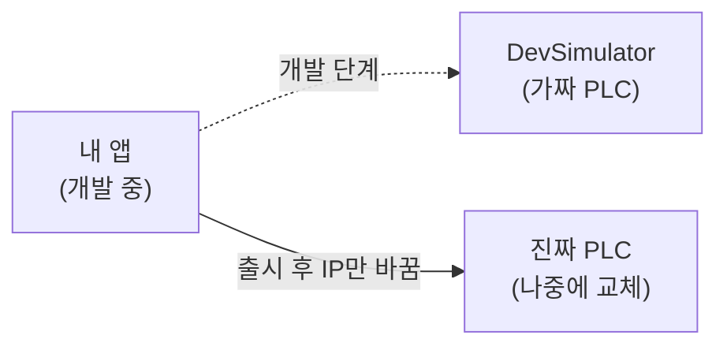
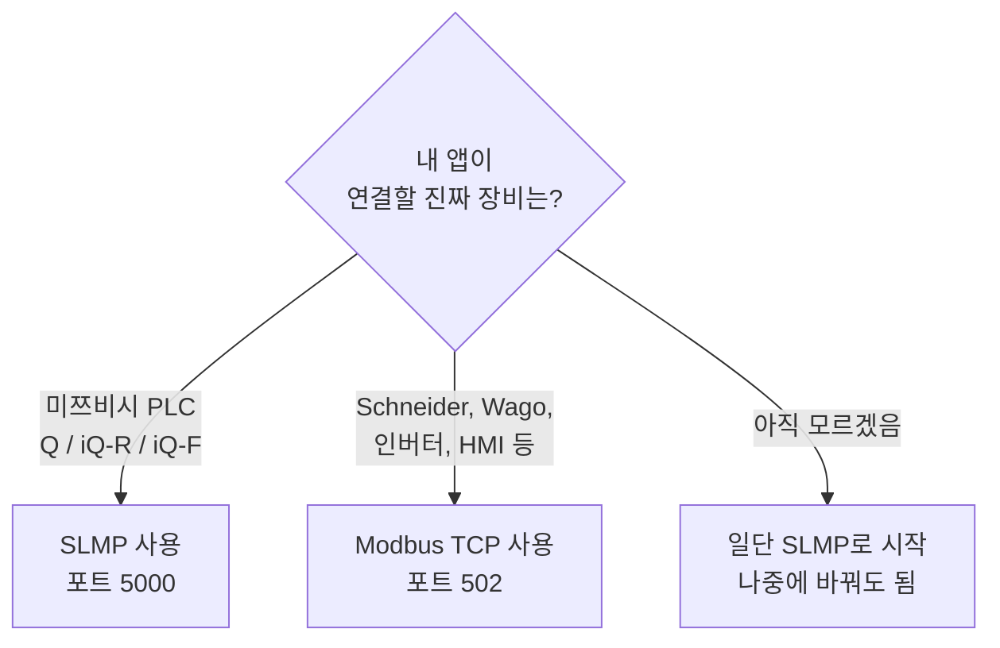
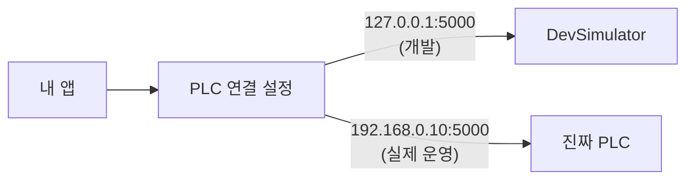

# DevSimulator 사용 가이드

> **이 가이드는 누구를 위한 건가요?**
> — 만든 앱이 PLC(미쯔비시 등 산업용 장비)와 통신해야 하는데, 아직 진짜 장비가 없는 분.
> — DevSimulator를 켜고, 내 앱을 거기에 연결해서 동작을 테스트하고 싶은 분.
> — 코드를 직접 짜지 않아도 됩니다. **버튼 몇 번**으로 끝납니다.

---

## 한 문장으로 요약

**DevSimulator는 컴퓨터 안에서 가짜 PLC 노릇을 해주는 프로그램입니다.**

내 앱은 진짜 PLC와 이야기하는 줄 알지만, 사실은 시뮬레이터와 이야기합니다.
나중에 진짜 PLC가 도착하면 **앱의 IP 주소만 바꿔주면** 그대로 동작합니다.



---

## 5분 만에 시작하기

### 1단계 — 시뮬레이터 켜기

1. `DevSimulator.exe` 실행
2. 화면 오른쪽 위의 **▶ 전체 시작** 버튼 클릭
3. 끝. 이제 시뮬레이터는 내 앱의 연결을 기다리고 있습니다.

> 화면 왼쪽 그룹 탭에 `● PLC :5000` 처럼 초록 점이 보이면 **정상 동작 중**입니다.

### 2단계 — 내 앱이 어디로 접속해야 하는지 확인하기

시뮬레이터 화면 가운데 위쪽에 이렇게 적혀 있습니다:

```
PLC — 시나리오 편집기      4단계   IP: 127.0.0.1 : 5000
```

이 두 가지를 내 앱의 **PLC 연결 설정**에 넣으면 됩니다:

| 항목 | 값 | 의미 |
|---|---|---|
| **IP 주소** | `127.0.0.1` | "내 PC 자신" 이라는 특수 주소 |
| **포트 번호** | `5000` | 시뮬레이터가 기다리는 통로 번호 (그룹마다 다름) |
| **통신 방식** | SLMP (또는 MC Protocol) | 미쯔비시 PLC와 동일 |

> **💡 다른 PC에서 접속하려면?** 같은 네트워크에 있다면 시뮬레이터 PC의 IP(예: `192.168.0.15`)를 사용. 사내망/방화벽 정책에 따라 추가 설정이 필요할 수 있습니다.

### 3단계 — 내 앱에서 연결 테스트

내 앱에서 위 IP/포트로 연결을 시도하세요. 내 앱이:
- "**연결 성공**" 메시지를 띄우면 → 끝났습니다. 이제 내 앱은 시뮬레이터를 진짜 PLC처럼 사용할 수 있습니다.
- "**연결 거부**" / "타임아웃" 이 뜨면 → 아래 **자주 막히는 곳** 섹션을 보세요.

---

## 시뮬레이터 화면 한눈에 보기

```
┌──────────────────────────────────────────────────────────────────────┐
│ ⚙ 장치 인터페이스 시뮬레이터          [▶ 전체 시작] [⏹ 정지] [↻ 초기화] │ ← 타이틀바
├──────────────────────────────────────────────────────────────────────┤
│ + 그룹 추가  [● PLC :5000]  [○ 컨베이어 :5001]                        │ ← 그룹 탭
├────────────┬────────────────────────────┬────────────────────────────┤
│            │ PLC — 시나리오 편집기      │ ⚡ 가상 장치 상태            │
│ 블록 도구   │              IP:Port [▶][⏹]│ status_a    OK             │
│ 상자        │                             │                            │
│            │  1 ▼ 신호 전송              │ ↻ 주기 태스크    [+ 추가]   │
│ ▶ 신호전송  │       메시지: REQ_01        │ D10 / 1000ms / Toggle      │
│ ⏬ 신호대기  │  2 ▼ 시간 지연              │                            │
│ ⏱ 시간지연  │       대기: 500ms           │ 📡 외부 입력 모사          │
│ ⚙ 상태변경  │  3 ▼ 디바이스 쓰기          │ [REQ_01     ] [전송]       │
│ ❓ 조건분기 │       D200 = 100            │                            │
│ ↻ 반복     │  4 ▼ End                    │                            │
│            │                             │                            │
│ SLMP       │                             │                            │
│ ✏ 디바이스 │                             │                            │
│ ⏳ 대기    │                             │                            │
├────────────┴────────────────────────────┴────────────────────────────┤
│ ❯ 실행 로그                                              [로그 지우기] │
│ [12:34:56.789] [Set Value] D200 = 100                                │
└──────────────────────────────────────────────────────────────────────┘
```

| 영역 | 무엇을 하나요? |
|---|---|
| **타이틀바 (맨 위)** | 모든 그룹을 한 번에 시작/정지/초기화 |
| **그룹 탭** | "PLC 1대 = 그룹 1개". 여러 장비를 동시에 시뮬레이트할 때 추가 |
| **블록 도구상자 (왼쪽)** | 시나리오 만들 때 쓰는 부품들 |
| **시나리오 편집기 (가운데)** | 시뮬레이터가 어떻게 반응할지 위에서 아래로 단계 작성 |
| **가상 장치 상태 (오른쪽 위)** | 실제 PLC 디바이스가 아닌, 시나리오 안의 변수 상태 |
| **주기 태스크 (오른쪽 가운데)** | "1초마다 D10을 1↔0 토글" 같은 자동 동작 |
| **외부 입력 모사 (오른쪽 아래)** | 진짜 외부 신호가 오는 것처럼 수동으로 신호 보내기 |
| **실행 로그 (맨 아래)** | 시뮬레이터가 지금 무엇을 하고 있는지 실시간 기록 |

---

## 내 앱에서 연결할 때 필요한 설정 (3가지만 기억)

대부분의 PLC 통신 라이브러리는 다음 3가지만 입력하면 동작합니다:

| 설정 | 시뮬레이터 기본값 | 어디서 확인하나? |
|---|---|---|
| **IP 주소** | `127.0.0.1` | 시나리오 편집기 헤더 IP 칸 (수정 가능) |
| **포트** | `5000` | 시나리오 편집기 헤더 Port 칸 (그룹마다 다름) |
| **프로토콜 / 기종** | SLMP / MC Protocol Q 시리즈 | 라이브러리 매뉴얼에서 "Mitsubishi Q" 또는 "SLMP 3E Frame" 선택 |

> ⚠️ 회사·라이브러리마다 부르는 이름이 다릅니다.
> - "**SLMP**", "**MC Protocol**", "**Mitsubishi**", "**Q-series**", "**MELSEC**" 중 하나를 선택하면 됩니다.
> - 프레임 종류는 **3E (TCP)** 입니다. (1E, 4E 등은 호환 안 됩니다)

### 흔히 쓰는 라이브러리별 설정 예시

| 라이브러리 | 설정 항목 |
|---|---|
| HslCommunication (.NET) | `MelsecMcNet("127.0.0.1", 5000)` |
| pyMcProtocol (Python) | `Type3E(host="127.0.0.1", port=5000)` |
| Easy Modbus | (Modbus를 쓴다면) `127.0.0.1`, port `502` |

> 위 라이브러리가 없어도 시뮬레이터의 [`examples/`](../examples/) 폴더에 Python·C# 샘플 클라이언트가 들어있습니다.

---

## 어떤 통신 방식을 골라야 하나? (SLMP vs Modbus)

대부분의 경우 **SLMP** 입니다. 다음 표로 빠르게 판단하세요:



| 진짜 장비 | 시뮬레이터에서 쓸 프로토콜 |
|---|---|
| 미쯔비시 Q / iQ-R / iQ-F PLC | **SLMP** |
| 미쯔비시 FX 시리즈 (구형) | SLMP (단, FX는 1E 프레임만 지원하는 경우 있음) |
| Schneider, Wago, ABB 등 일반 PLC | **Modbus TCP** |
| 인버터 (Yaskawa, LS, 등) | Modbus TCP가 흔함 |
| 자체 개발 장비 / 커스텀 통신 | (현재 미지원, 추후 Custom JSON 예정) |

---

## 시나리오는 뭐고 왜 만드나?

**시나리오 = 시뮬레이터가 어떻게 반응할지 정해놓은 시나리오.**

예시 — "내 앱이 D100을 1로 쓰면, 시뮬레이터가 2초 뒤에 D200을 100으로 응답한다":

| 단계 | 블록 | 설정 |
|---|---|---|
| 1 | 디바이스 대기 | `D100 == 1` |
| 2 | 시간 지연 | `2000 ms` |
| 3 | 디바이스 쓰기 | `D200 = 100` |
| 4 | End | — |

이렇게 만들면 진짜 PLC처럼 "내 앱이 보낸 신호에 반응"합니다.

> **시나리오 없이도 사용 가능합니다.** 그냥 시작만 누르면 시뮬레이터는 단순 메모리 역할을 하고, 내 앱이 쓴 값을 그대로 기억합니다. 시나리오는 "장비가 알아서 응답해줘야 할 때" 만드는 겁니다.

### 만들기 (5단계)
1. 왼쪽 **블록 도구상자**에서 원하는 블록을 가운데 시나리오 편집기로 드래그
2. 블록 안의 입력칸에 값 입력 (예: `D100`, `1`, `2000`)
3. 위→아래 순서대로 실행됩니다. 순서를 바꾸려면 블록 위 ▲▼ 버튼
4. 그룹 헤더의 ▶ 버튼으로 그 그룹만 시작
5. 실행 중인 단계는 노란 테두리로 표시됩니다

> 💾 만든 시나리오는 그룹 헤더의 💾 버튼으로 JSON 파일로 저장 / 📂 버튼으로 불러올 수 있습니다.

---

## 자주 막히는 곳 (트러블슈팅)

### "연결 거부 (Connection refused)"
- ✅ 시뮬레이터의 **▶ 전체 시작**을 눌렀나요? (또는 그룹별 ▶)
- ✅ 내 앱의 포트와 시뮬레이터 그룹 탭의 `:포트` 가 일치하나요?
- ✅ Windows 방화벽이 막고 있을 수 있습니다 — DevSimulator를 처음 실행할 때 방화벽 허용 팝업이 떴는지 기억해보세요. 안 떴다면 **Windows Defender 방화벽 → 앱 허용** 에서 추가.

### "연결은 되는데 응답이 없음 / 멈춤"
- ✅ 내 앱이 보내는 명령이 **SLMP 3E 프레임**인지 확인 (1E, 4E는 미지원)
- ✅ 미지원 명령(예: Random Read)을 보내면 시뮬레이터는 응답 없이 무시합니다 — 내 앱에 **read timeout (5초)** 을 꼭 설정하세요.

### "값이 이상하게 나옴 (1234를 보냈는데 13313이 옴)"
- ✅ **엔디언 문제**입니다. SLMP는 **리틀 엔디언(LE)**, Modbus는 **빅 엔디언(BE)**. 라이브러리 설정을 확인하세요.
- ✅ Word(16비트) vs Bit를 헷갈렸을 수 있습니다 — 비트 디바이스(`M / X / Y`)에 워드 명령으로 큰 수를 쓰면 0/1로만 처리됩니다.

### "한 PC에서 여러 PLC를 시뮬레이트하고 싶음"
- ✅ 시뮬레이터 그룹 탭의 **+ 그룹 추가** 버튼 클릭. 그룹마다 다른 포트(5000, 5001, 5002...)를 자동 할당.
- ✅ 내 앱은 각 가짜 PLC에 다른 포트로 접속하면 됩니다.

### "내가 D100을 썼는데 가상 장치 상태에 안 보임"
- ℹ️ "가상 장치 상태"는 **시나리오 변수**(예: 처리 단계, 결과 코드)를 보여주는 패널입니다.
- ℹ️ 진짜 PLC 디바이스(D, M, Y, X 등)는 **실행 로그**나 외부 클라이언트(예: 동봉된 TestClient.exe)로 확인하세요.

### "내 앱이 진짜 PLC와 동작이 다름"
- ✅ 시뮬레이터는 **명령 단위(read/write)**로 호환되지만, 실제 PLC의 스캔 사이클·이벤트 처리·시간 지연은 시나리오로 직접 재현해야 합니다. 진짜 장비의 동작을 시나리오로 옮겨주세요.

---

## 실제 PLC로 교체하기 (목적 도달)

개발이 끝나고 진짜 PLC가 도착했을 때:

1. PLC를 네트워크에 연결, IP 주소 확인 (예: `192.168.0.10`)
2. 내 앱의 PLC 연결 설정에서 **IP만** `127.0.0.1` → `192.168.0.10` 으로 변경
3. 포트는 보통 `5000` 그대로 (PLC 설정 확인 필요)
4. **이게 끝입니다.** 코드 수정 0줄.



---

## 더 알아보기

- [📖 README](../README.md) — 프로젝트 전체 개요
- [🔌 통신 프로토콜 명세](protocol-guide.md) — 바이트 단위로 어떻게 통신하는지 (개발자용)
- [🎓 사용자 가이드 (상세)](user-guide.md) — 더 상세한 사용 방법
- 실행 가능한 예제 — [`examples/`](../examples/) 폴더의 Python·C# 샘플
- 동봉 테스트 앱 — `TestClient.exe` (연결·읽기·쓰기·핸드쉐이크 GUI 테스트)
